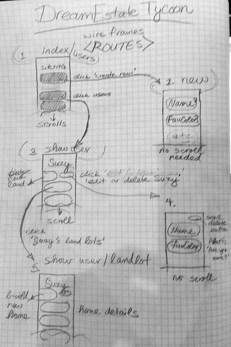

# DreamEstate Tycoon

### Project 2, by Jeremy Abernathy

Started: 01-03-18, Re-started: 01-04-18, **Due:** Monday 01-08-18

## Link to Heroku

My deployed app here: [DreamEstate app](https://arcane-caverns-60948.herokuapp.com/). 

## Project Description, Goals & Self-Review

Welcome to Dream Home Tycoon. Basically you create a user, choose some land you want (or several lots of land), and choose what kind of home you want to build (or many homes). It will be somewhat cartoon-ish, but clever. And possibly, it could later evolve into a more realistic real-estate simulator. 

Link to grading rubric here: [Project 2 Outline](https://git.generalassemb.ly/atl-wdi/wdi-curriculum/tree/master/projects/unit_02).

**Technologies used:** HTML5, CSS (Flexbox, but not Grid), JavaScript, jQuery, Node.js, Express.js, MongoDB.js, Mongoose, Handlebars

**My approach:** Working from the ERD and Wireframes was very useful. I was able to scrap my first idea, for good logistic reasons, but then I suffered from some "analysis paralysis" sketching out my second idea. I tended to overthink things, but the planning definitely helped keep regain focus. 

**Unsolved problems:** The website looks a little too basic. There needs to be more graphics. Also, I did not have time to implement as many custom options for Users (such a way do neatly display if their "lands" were urban or swampy, or if their homes were single story or taller). 

**Next version:** I have many ideas, but I think these unique options would be the first step. After that the extra "bling" I mentioned in my presentation such as resource tokens, etc. 

## ERDs

Here's how I plan to model my app's data and relationships, or ERD (Entity Relationship Diagrams). Note that the Users page will have restful routes for full CRUD. 

Figma diagram:


Example code with nested objects:

```
const exampleUsers = [
  {
    name: 'Suzy', // example with two landLots and threee homes
    favColor: 'lavender',
    landLots: [
      {
        name: "Lot A34",
        location: 'Midtown Atlanta',
        type: 'urban-ish',
        homes: [
          {
            name: "Suzy's Place",
            type: "Family Home",
            color: 'papayawhip',
            hasGarage: true,
            hasBigFrontYard: false
          }
        ]
      },
      {
        name: "Lot F26",
        location: "Glengarry, Florida",
        type: 'swamp',
        homes: [
          {
            name: "Suzy's Disco Palace",
            type: "Skyscraper",
            color: 'magenta',
            hasGarage: false,
            hasBigFrontYard: false
          },
          {
            name: "Secret Witchcraft Den",
            type: "log cabin",
            color: 'lavender',
            hasGarage: false,
            hasBigFrontYard: false
          }
        ]
      }
    ]
  }
]
console.log(exampleUsers)
```

## Wireframes

Sorry if the image looks a little rough.

Views and routes sketch:



## User Stories

Link to my Trello board here: [Project 2 Planning](https://trello.com/b/lb8Tv2XL/dream-estate1-project-2). 

That's it. Thanks so much for your feedback!

-JA