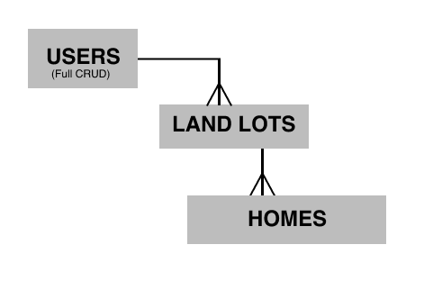

# DreamEstate Tycoon

### Project 2, by Jeremy Abernathy

Started: 01-03-18, Re-started: 01-04-18, **Due:** Monday 01-08-18

### First-day checklist

Needed before I start:

1. Deploy to Heroku 
**-- Note: started having issues 2:30pm Thurs**
2. ERD with 3 data models __done
3. Restful route for 1 model: GET, POST, PUT, and DELETE __done
4. Mongoose installed and database created, connected __done
5. Wireframes 
6. Trello board with User Stories 

Link to grading rubric here: [Project 2 Outline](https://git.generalassemb.ly/atl-wdi/wdi-curriculum/tree/master/projects/unit_02).

## Project Description & Goals

Now this project is called DreamEstate Tycoon. Basically you create a user, choose some land you want (or several lots of land), and choose what kind of home you want to build (or many homes). It will be somewhat cartoon-ish, but clever. And possibly, it could later evolve into a more realistic real-estate simulator.

## Link to Heroku

My deployed app here: [DreamEstate app](https://boiling-bastion-78431.herokuapp.com/). 

**-- Note:** Heroku reported down around 2:30pm Thurs.

## ERDs

Here's how I plan to model my app's data and relationships, or ERD (Entity Relationship Diagrams). Note that the Users page will have restful routes for full CRUD. 

Figma diagram:



Example code with nested objects:

```
exampleUsers: [
  {
    name: 'Suzy', // example with two landLots and threee homes
    favColor: 'lavender',
    landLots: [
      {
        name: "Lot A34",
        location: 'Midtown Atlanta',
        type: 'urban-ish',
        homes: [
          {
            name: "Suzy's Place",
            type: "Family Home",
            color: 'papayawhip',
            hasGarage: true,
            hasBigFrontYard: false
          }
        ]
      },
      {
        name: "Lot F26",
        location: "Glengarry, Florida",
        type: 'swamp',
        homes: [
          {
            name: "Suzy's Disco Palace",
            type: "Skyscraper",
            color: 'magenta',
            hasGarage: false,
            hasBigFrontYard: false
          },
          {
            name: "Secret Witcraft Den",
            type: "log cabin",
            color: 'lavender'
            hasGarage: false,
            hasBigFrontYard: false
          }
        ]
      }
    ]
  }
]
```

## Wireframes

Sorry -- I will upload a more professional-looking wireframe soon.

Views and routes sketch:

[Hand-drawn image](z_dream-estate_WIREFRAME-1 "hand-drawn image")

## Link to Trello

link 

## Reach/Icebox

More about these later. 

## End

I'm back to work!

-JA